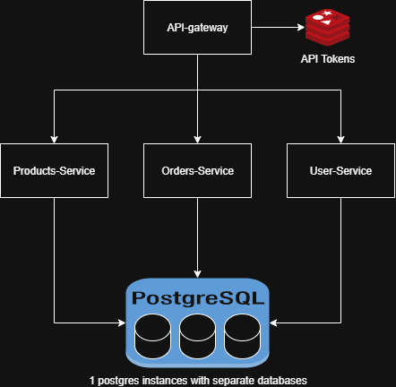

# API Gateway - Technical Challenge

## Table of Contents
- [Overview](#overview)
- [Architecture](#architecture)
- [Prerequisites](#prerequisites)
- [AWS Configuration](#aws-configuration)
- [Quick Start](#quick-start)
- [Token Generation](#token-generation)
- [Running the Application](#running-the-application)
- [Configuration](#configuration)
- [Hot Reload Feature](#hot-reload-feature)
- [API Documentation](#api-documentation)
- [Testing](#testing)
- [Troubleshooting](#troubleshooting)
- [Project Structure](#project-structure)

## Overview

This is an API Gateway implementation that routes requests to multiple microservices (User Service, Orders Service, and Product Service). The gateway provides:

- Dynamic routing and request forwarding
- Authentication and authorization with API tokens (stored in Redis)
- Rate limiting
- CORS handling
- Hot configuration reload (no restart required)
- Health checks and metrics endpoints

### Tech Stack
- **Language**: Go 1.25
- **Framework**: Echo (HTTP framework)
- **Database**: PostgreSQL 17.6
- **Cache**: Redis 8.2.1 (for API token storage)
- **Container**: Docker & Docker Compose
- **Configuration**: Viper (with hot reload)

## Architecture



### Services

| Service | Port | Description |
|---------|------|-------------|
| API Gateway | 8300 | Main entry point, routes requests, validates tokens |
| User Service | 8000 | User management |
| Orders Service | 8100 | Order processing |
| Product Service | 8200 | Product catalog |
| PostgreSQL | 5432 | Primary database |
| Redis | 6379 | API token storage |

### Authentication Flow

The API Gateway uses Redis to store and validate API tokens:

1. On first health check, the gateway generates 2 tokens:
    - Token 1: Valid token (stored in Redis) "key-123"
    - Token 2: Invalid token (not stored in Redis) "key-1234"
2. Protected endpoints validate tokens against Redis
3. Invalid tokens or missing tokens return 401

## Prerequisites

Before running this application, ensure you have the following installed:

### Required Software
- **Go**: Version 1.25 
  ```bash
  go version
  ```
- **Docker**: Version 28.4.0 or higher
  ```bash
  docker --version
  ```
- **Docker Compose**: Version 2.39.4 or higher
  ```bash
  docker-compose --version
  ```
- **AWS CLI**: Version 2.22.28
  ```bash
  aws --version
  ```
- **Git**: For cloning the repository
  ```bash
  git clone <repository-url>
  cd api-gateway
  ```

### Optional (for local development)
- **Go**: Version 1.25 or higher
- **curl** or **Postman**: For API testing

## AWS Configuration

The application uses Docker images hosted in AWS ECR (Elastic Container Registry). You need to configure AWS CLI and authenticate to pull these images.

### Step 1: Install AWS CLI

**macOS:**
```bash
brew install awscli
```

**Linux:**
```bash
curl "https://awscli.amazonaws.com/awscli-exe-linux-x86_64.zip" -o "awscliv2.zip"
unzip awscliv2.zip
sudo ./aws/install
```

**Windows:**
Download and run the installer from: https://aws.amazon.com/cli/

### Step 2: Configure AWS Credentials

You need AWS credentials with ECR read permissions. Contact the project administrator for credentials.

```bash
# Configure AWS CLI
aws configure

# You'll be prompted for:
AWS Access Key ID [None]: <YOUR_ACCESS_KEY>
AWS Secret Access Key [None]: <YOUR_SECRET_KEY>
Default region name [None]: us-east-1
Default output format [None]: json
```

### Step 3: Authenticate Docker to ECR

```bash
# Login to ECR
aws ecr get-login-password --region us-east-1 | docker login --username AWS --password-stdin 049139783164.dkr.ecr.us-east-1.amazonaws.com
```

You should see:
```
Login Succeeded
```

**Note**: This authentication expires after 12 hours. If you encounter image pull errors later, re-run this command.

## Quick Start

### Option 1: Local Development (Without API Gateway Container)

This runs backend services in Docker, allowing you to run the API Gateway locally for development:

```bash
# Start backend services
docker-compose -f docker/docker-compose-localdev.yaml up -d

# Run API Gateway locally (in another terminal)
go run main.go server

# Or build and run
go build -o api-gateway .
./api-gateway server
```

### Option 2: Full Docker Environment (Recommended for Testing)

Run everything in Docker, including the API Gateway:

```bash
# Using locally built image
docker-compose -f docker/docker-compose-test-container-with-devdocker.yaml up -d

# OR using ECR image
docker-compose -f docker/docker-compose-test-container.yaml up -d
```

### Verify Services are Running

```bash
# Check all services are healthy
docker-compose -f docker/docker-compose-test-container-with-devdocker.yaml ps

# All services should show "Up" or "Up (healthy)"
```

## Token Generation

**IMPORTANT**: The API Gateway generates authentication tokens on the first health check request.

### Step 1: Hit the Health Check Endpoint

After starting all services, make a request to the health check endpoint:

```bash
# This triggers token generation
curl http://localhost:8300/api/health/ready
```

**Expected Response:**
```json
{
  "status": "ready",
  "timestamp": "2025-10-02T20:24:59.2762595-05:00",
  "service": "api-gateway",
  "version": "1.0.0",
  "uptime": "12.322685s",
  "checks": {
    "redis": {
      "message": "Connection successful",
      "status": "healthy"
    }
  }
}
```

### Step 2: Generated Tokens

After hitting the health check, the gateway automatically generates 2 test tokens:

- **Valid Token**: `key-123` (stored in Redis with value `true`)
- **Invalid Token**: `key-1234` (stored in Redis with value `false`)

### Step 3: Test Token Authentication

```bash
# Test with VALID token (should work)
curl -H "X-API-Key: key-123" http://localhost:8300/api/user/users/1
```
```json
{
  "id": 1,
  "email": "johns.doe@example.com",
  "first_name": "Joshn",
  "last_name": "Dose",
  "full_name": "Joshn Dose",
  "phone": "+12334567890",
  "status": "active",
  "created_at": "2025-10-03T01:27:43.503561Z",
  "updated_at": "2025-10-03T01:27:43.503561Z"
}
```
```bash
# Test with INVALID token (should fail with 401/403)
curl -H "X-API-Key: key-1234" http://localhost:8300/api/user/users/1
```
```json
{
  "Code": "API_TOKEN_NOT_VALID",
  "Message": "invalid api key"
}
```
```bash
# Test without token (should fail with 401/403)
curl http://localhost:8300/api/user/users/1
```
```json
{
  "Code": "API_TOKEN_NOT_VALID",
  "Message": "missing api key"
}
```

### How Token Storage Works

1. **Token Generation**: On first health check, the gateway generates 2 tokens in Redis:
   ```
   key-123  = true   (valid)
   key-1234 = false  (invalid)
   ```
2. **Token Validation**: For each protected request:
    - Gateway extracts token from `X-API-Key` header
    - Queries Redis to get the token value
    - Allows request if value is `true`, rejects if `false` or not found
3. **Token Lifecycle**: Tokens persist in Redis until manually removed or Redis is flushed

## Running the Application

## Configuration

### Configuration Files

Configuration files for local application are located in `configs/`

and for docker images are located in docker/configs these are mounted as volumes inside the containers on the docker compose file.

```
docker/configs/
├── config.yaml                # API Gateway config
├── api-gateway-config.yaml    # Alternative API Gateway config
├── user-config.yaml           # User service config
├── orders-config.yaml         # Orders service config
└── product-config.yaml        # Product service config
```

### Main Configuration (config.yaml)

The API Gateway is configured via `configs/config.yaml`:

```yaml
environment: development
version: 1.0.0

server:
  port: "8300"
  host: "0.0.0.0"
  read_timeout: "30s"
  write_timeout: "30s"
  path_prefix: "/api"

redis:
  host: "localhost"
  port: "6379"
  password: ""
  database: 0

backends:
  - host: "http://localhost:8000"
    id: "user"
    path_prefix: "/api/v1"
    routes:
      - id: "user-list"
        method: "GET"
        path: "/users"
        path_type: "exact"
        enabled: "true"
        auth_policy:
          type: "api"
          enabled: "true"
```

### Environment Variables

Override configuration using environment variables:

```bash
# Set environment
export PRODUCT_SERVICE_ENVIRONMENT=production

# Override server port
export PRODUCT_SERVICE_SERVER_PORT=8301

# Override Redis connection
export PRODUCT_SERVICE_REDIS_HOST=redis-prod
export PRODUCT_SERVICE_REDIS_PORT=6379
```

## API Documentation

### Base URL

```
http://localhost:8300/api
```

for selecting a specific service add the first path segment after `/api` like api/user, this has to match with the configuration on the yaml file.

### Authentication

Most endpoints require an API token. Include it in the `X-API-Key` header:

```bash
curl -H "X-API-Key: key-123" http://localhost:8300/api/v1/users
```

**Remember**: Tokens are automatically generated on first health check:
- Valid token: `key-123`
- Invalid token: `key-1234`

### Health Endpoints (No Authentication Required)

| Endpoint | Method | Description |
|----------|--------|-------------|
| `/health` | GET | Gateway health check (triggers token generation) |
| `/api/v1/health` | GET | Service health check |
| `/api/v1/health/ready` | GET | Service readiness check |
| `/api/v1/health/live` | GET | Service liveness check |
| `/metrics` | GET | Prometheus metrics (if enabled) |

### User Service Endpoints

| Endpoint | Method | Auth Required | Description |
|----------|--------|---------------|-------------|
| `/api/v1/users` | GET | ✅ Yes | List all users |
| `/api/v1/users` | POST | ✅ Yes | Create user |
| `/api/v1/users/:id` | GET | ✅ Yes | Get user by ID |
| `/api/v1/users/email/:email` | GET | ✅ Yes | Get user by email |

### Orders Service Endpoints

| Endpoint | Method | Auth Required | Description |
|----------|--------|---------------|-------------|
| `/api/v1/orders` | GET | ✅ Yes | List orders |
| `/api/v1/orders` | POST | ✅ Yes | Create order |
| `/api/v1/orders/:id` | GET | ✅ Yes | Get order by ID |
| `/api/v1/orders/:id/confirm` | POST | ✅ Yes | Confirm order |
| `/api/v1/orders/:id/cancel` | POST | ✅ Yes | Cancel order |
| `/api/v1/orders/:id/items` | POST | ✅ Yes | Add item to order |
| `/api/v1/orders/:id/items/:product_id` | PUT | ✅ Yes | Update order item |
| `/api/v1/orders/:id/items/:product_id` | DELETE | ✅ Yes | Remove order item |

### Product Service Endpoints

| Endpoint | Method | Auth Required | Description |
|----------|--------|---------------|-------------|
| `/api/v1/products` | GET | ✅ Yes | List products |
| `/api/v1/products` | POST | ✅ Yes | Create product |
| `/api/v1/products/:id` | GET | ✅ Yes | Get product by ID |
| `/api/v1/products/sku/:sku` | GET | ✅ Yes | Get product by SKU |
| `/api/v1/products/:id/stock` | PATCH | ✅ Yes | Update product stock |
| `/api/v1/products/:id/price` | PATCH | ✅ Yes | Update product price |

### Example Requests

**1. Generate Tokens (Required First Step):**
```bash
curl http://localhost:8300/health
# Check logs for generated tokens
```

**2. Create a User (Requires Token):**
```bash
curl -X POST http://localhost:8300/api/user/users \
  -H "Content-Type: application/json" \
  -H "X-API-Key: <VALID_TOKEN>" \
  -H "X-Request-ID: <ID>" \
  -d '{
  "email": "johns.doe@example.com",
  "password": "SecsurePass123!",
  "first_name": "Joshn",
  "last_name": "Dose",
  "phone": "+12334567890"
}'
```

**3. List Users (Token Required):**
```bash
curl -X GET "http://localhost:8300/api/user/users?page=0&page_size=3" -H "X-Request-ID: <ID>" -H "X-API-Key: <VALID_TOKEN>"
```

**4. Get User by ID (Requires Token):**
```bash
curl -X GET http://localhost:8300/api/user/users/1 -H "X-Request-ID: <ID>" -H "X-API-Key: <VALID_TOKEN>"
```

**5. Test Invalid Token:**
```bash
curl -X GET http://localhost:8300/api/user/users/1 -H "X-Request-ID: <ID>" -H "X-API-Key: key-1234"
# Expected: 401 Unauthorized or 403 Forbidden
```

## Testing

### Running Unit Tests

```bash
# Run all tests
go test ./...

# Run tests with coverage
go test -cover ./...

# Run tests with verbose output
go test -v ./...

# Run specific package tests
go test ./internal/domain/entities/...
```

## Troubleshooting

### Common Issues

#### 1. ECR Authentication Expired

**Error:**
```
Error response from daemon: pull access denied for 049139783164.dkr.ecr.us-east-1.amazonaws.com/develop/user-service
```

**Solution:**
```bash
aws ecr get-login-password --region us-east-1 | docker login --username AWS --password-stdin 049139783164.dkr.ecr.us-east-1.amazonaws.com
```

#### 2. Tokens Not Generated

**Symptom:** Authentication always fails

**Solution:**
```bash
# Make sure you hit health check first
curl http://localhost:8300/api/health/ready

# Verify Redis is running
docker-compose -f docker/docker-compose-test-container-with-devdocker.yaml ps redis

# Verify tokens exist in Redis
docker exec -it redis redis-cli
GET key-123
# Should return: "true"
GET key-1234
# Should return: "false"
```

#### 3. Authentication Fails with Valid Token

**Check:**
```bash
# Verify token exists in Redis
docker exec -it redis redis-cli

# Inside Redis CLI:
GET key-123
# Should return: "true"

GET key-1234
# Should return: "false"
```

**Solution:**
```bash
# Regenerate tokens by hitting health check
curl http://localhost:8300/health

# Or restart with fresh Redis
docker-compose -f docker/docker-compose-test-container-with-devdocker.yaml down -v
docker-compose -f docker/docker-compose-test-container-with-devdocker.yaml up -d
curl http://localhost:8300/health
```

### Debug Mode

Enable debug logging:

```yaml
# In config.yaml
logging:
  level: "debug"
  format: "text"
```

### Viewing Logs

```bash
# All services
docker-compose -f docker/docker-compose-test-container-with-devdocker.yaml logs -f

# Specific service
docker-compose -f docker/docker-compose-test-container-with-devdocker.yaml logs -f api-gateway

# Last 100 lines
docker-compose -f docker/docker-compose-test-container-with-devdocker.yaml logs --tail=100 api-gateway

# Filter for tokens
docker-compose -f docker/docker-compose-test-container-with-devdocker.yaml logs api-gateway | grep -i token
```

### Clean Start

If experiencing persistent issues:

```bash
# Stop everything
docker-compose -f docker/docker-compose-test-container-with-devdocker.yaml down -v

# Remove all containers, networks, and volumes
docker system prune -a --volumes

# Re-authenticate to ECR
aws ecr get-login-password --region us-east-1 | docker login --username AWS --password-stdin 049139783164.dkr.ecr.us-east-1.amazonaws.com

# Start fresh
docker-compose -f docker/docker-compose-test-container-with-devdocker.yaml up -d

# Wait and generate tokens
sleep 30
curl http://localhost:8300/api/health/ready
```

---

**Version**: 1.0.0  
**Last Updated**: January 2025  
**Author**: Juan David Cabrera Duran